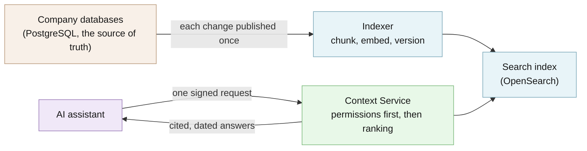

# Agentic Context Service

For teams building AI assistants: one lookup service for company facts that checks permissions and cites every source.

[](https://github.com/hseshadr/agentic-context-service/actions/workflows/dagger.yml)
[](LICENSE)

[Docs](docs/architecture/README.md) · [Quickstart](#try-it-in-60-seconds)

```text
input:  the same question, "What is the discount limit for NS-100?", asked by two assistants
        of one company (one doing pricing work, one doing customer support)
output: published 3 records: a pricing rule, a finance-only note, another company's rule
        pricing-analysis asks "What is the discount limit for NS-100?" -> 1 result(s)
          NS-100 may be discounted at most 20% without pricing-lead approval.
          source: postgres://catalog/NS-100 v7, 90s old, trust: verified
        customer-support asks "What is the discount limit for NS-100?" -> 0 result(s)
```
<sub>Real output of the example below.</sub>

## At a glance

- **What it does** — Like a company search box, but built for AI assistants (software "agents"
  that answer questions or propose actions): before anything is ranked, it removes what the
  asking assistant is not allowed to see, and every answer it returns names its source record,
  version, and age.
- **Who it's for** — An engineer at a company running several AI assistants who is tired of
  each one wiring itself to the company's databases, re-implementing access rules, and quoting
  facts nobody can trace back to a record.
- **What stays on your device / what leaves it** — Stays: everything. You run it on your own
  machines, and your records, search index, and assistant notes stay there; the example below
  makes no network calls at all (the test suite blocks network access). Leaves: nothing by
  default. Only if you switch the optional live AI mode on (`ACS_SHOWCASE_AGENT_MODE=deep`) do
  the demo task and the cited facts its two read-only lookup tools return go to the OpenRouter
  model you configure, with your own key.
- **Runs on** — Python 3.13 with [uv](https://docs.astral.sh/uv/) on Linux or macOS. The full
  local showcase also needs Docker with Compose v2.
- **Not for** — A chat-with-your-documents app or a framework for building assistants: it is the
  lookup layer they call. Also not a database of record; your source systems stay the truth.
- **Status** — Beta (pre-1.0): version 0.1.0, no release tagged yet and nothing published to a
  package index. See [CHANGELOG](CHANGELOG.md).

## Try it in 60 seconds

```bash
git clone https://github.com/hseshadr/agentic-context-service.git && cd agentic-context-service && uv sync
```

```bash
uv run python examples/quickstart/governed_retrieval.py
```

The script publishes three records into the in-memory store (no search server needed) and asks
the same question as two assistants from the same company. The pricing assistant gets only the
pricing rule, with its source; the finance-only note and the other company's rule never reach it;
the support assistant gets nothing:

```text
published 3 records: a pricing rule, a finance-only note, another company's rule
pricing-analysis asks "What is the discount limit for NS-100?" -> 1 result(s)
  NS-100 may be discounted at most 20% without pricing-lead approval.
  source: postgres://catalog/NS-100 v7, 90s old, trust: verified
customer-support asks "What is the discount limit for NS-100?" -> 0 result(s)
```

The first `uv sync` downloads Python packages and can take longer than a minute.

More runnable examples: [`examples/`](examples/).

<!-- ======================== BELOW THE FOLD ======================== -->

## How it works

Source systems publish each change once: PostgreSQL changes flow asynchronously through Debezium
and Redpanda to an indexer that chunks, embeds, and writes them to OpenSearch with external
versions. An assistant sends one request to the Context Service API with a signed workload
identity. OPA turns that identity into constraints that filter the candidate set **before** any
ranking; OpenSearch then combines exact BM25 matching with vector search. The API returns compact,
cited, freshness-labeled context that the assistant must treat as untrusted data.



**[Explore the interactive architecture map →](docs/architecture/index.html)**
(a five-minute guided tour). The Archify dataflow diagram
[`governed-context-flow.html`](docs/architecture/governed-context-flow.html) is generated from
[`docs/architecture/governed-context-flow.dataflow.json`](docs/architecture/governed-context-flow.dataflow.json).
Deep dive: [docs/architecture/README.md](docs/architecture/README.md).

The core uses small Python `Protocol` ports. FastAPI, OpenSearch, OPA, Kafka, embeddings, clocks,
IDs, telemetry, and audit sinks are adapters assembled in explicit composition roots.

## What you can do

- Retrieve tenant-scoped, policy-filtered, hybrid-ranked context with mandatory citations and
  freshness through one bounded API — [OpenAPI contract](packages/contracts/openapi.yaml)
- Project PostgreSQL changes into the index asynchronously, with deterministic replay, ordering,
  and deletion behavior — [ADR 0004](docs/adr/0004-versioned-indices-and-atomic-aliases.md),
  [ADR 0005](docs/adr/0005-bounded-retries-and-checkpoints.md)
- Store assistant memory that stays visibly labeled as non-authoritative —
  [specification](docs/specification.md)
- Run a bounded agent proposal lane where deterministic code, not the model, approves —
  [retail pricing agent](examples/retail-pricing-agent/README.md),
  [fulfillment agent](examples/fulfillment-agent/README.md)
- Produce reproducible retrieval-quality evidence from a checked-in corpus — `make eval`

## Why this and not X

| Alternative | Better choice when | What this adds |
| --- | --- | --- |
| Each assistant queries databases directly | You have one assistant and one data source | One place for access rules, citations, and freshness instead of one copy per assistant |
| A vector database with a retrieval library | You only need semantic search over documents | Permission filtering before ranking, exact plus semantic matching, change-data sync with replay and deletion semantics |
| A hosted enterprise search product | You want a managed service and accept its data handling | Self-hosted, open-source (MIT) contracts you can read and test |
| Do nothing | Assistants never touch sensitive or fast-changing data | Auditable answers when they do |

## Security and trust model

- **Verified:** tenant and entitlement scope come only from a verified identity and a signed
  workload context (HMAC over the request headers with `ACS_SIGNING_SECRET`); user filters may
  narrow that scope but can never widen it. CDC writes use deterministic IDs and OpenSearch
  external versioning.
- **Refuses rather than warns:** if OPA is unavailable or undecided, governed endpoints refuse
  the request and readiness fails. A delayed event cannot resurrect a deleted record, and an
  equal-version conflict is reported rather than resolved by last-write-wins. In the agent
  lanes, a missing tool call, stale or conflicting evidence, or a provider failure refuses to
  reserve.
- **Not protected:** a compromised host or operator, and anything the model provider you opt
  into does with the data sent to it. The local Compose stack disables some production controls
  (TLS, private networking, OpenSearch document/field security) to stay runnable on a laptop.
- **Verify a release:** no release has been tagged yet. To check a commit, run the same gate CI
  runs (`make verify`, below).

Read the [threat model](docs/threat-model/README.md). See [SECURITY.md](SECURITY.md) for
reporting a vulnerability.

## What this proves / what it does not prove

- Permission filtering, citation, freshness, replay, ordering, and deletion rules — the unit,
  contract, and security suites under [`tests/`](tests/), run by `make verify` with at least 90%
  line and branch coverage.
- Real OpenSearch and CDC behavior — `make integration` against the local Compose stack.
- Retrieval quality — `make eval` writes JSON and Markdown evidence under [`reports/`](reports/)
  and fails on unauthorized results, missing citations, or a relevance regression.
- The browser showcase — a Chromium Playwright test (`make ui`) against the real FastAPI app.

It does **not** prove: live CDC from the offline evaluator (that corpus records deterministic
results; it never contacts OpenSearch), production capacity or SLOs, or behavior of any real
model provider. The quickstart above uses the in-memory store, whose semantic search is a
deterministic stand-in, so it runs in exact-match (lexical) mode.

## Install

Prerequisites: Python 3.13, `uv`, `make`; Docker with Compose v2 for the full stack.

```bash
git clone https://github.com/hseshadr/agentic-context-service.git
cd agentic-context-service
cp .env.example .env
make bootstrap   # uv sync --all-extras --all-groups
```

No package has been published to a package index.

## Usage & API

### Ten-minute local showcase

```bash
make up
make seed
make demo
```

The deterministic `demo-retail`/`NORTHSTAR` story shows:

1. hybrid-ranked pricing context with citations;
2. a PostgreSQL update flowing through real CDC;
3. the new source version and freshness becoming searchable;
4. a denied or filtered unauthorized persona;
5. session memory retrieved later as non-authoritative context;
6. trace, metrics, audit, and evaluation evidence.

`make demo` exits nonzero if an expectation is not met. Stop the stack without deleting named
volumes with `make down`. See [operations](docs/operations.md) for health checks and playbooks.

### Browser proof

```bash
make ui-install
make ui
```

This browser gate is separate from `make verify`, so a normal library or CDC check does not
download a browser. CI runs it for every pull request and push to `main`. To run the same flow
against the running Compose stack — including the idempotent fulfillment-promise mutation, its CDC
projection, a bounded proposal, explicit human approval, and a deterministic transaction trace:

```bash
PLAYWRIGHT_BASE_URL=http://127.0.0.1:8080 PLAYWRIGHT_LIVE_CDC=1 make ui
```

The local demo transaction adapter is a no-op; it never creates a real order.

### API shape

Workflows call a bounded contract; they cannot submit raw OpenSearch DSL or choose a tenant.

```http
POST /v1/context:retrieve
Authorization: Bearer <delegated identity>
X-Workflow-ID: pricing-assistant
X-Workflow-Revision: 4f2d9e1
X-Environment: development
X-Request-ID: req_demo_001
X-Trace-ID: trace_demo_001
Content-Type: application/json

{
  "query": "Why did item NS-100 miss its pricing target?",
  "corpora": ["pricing", "product", "approved-decisions"],
  "filters": {"brand": ["NORTHSTAR"], "market": ["US"]},
  "retrieval": {
    "mode": "hybrid",
    "candidate_limit": 100,
    "result_limit": 12,
    "rerank": false,
    "max_context_tokens": 6000,
    "max_age_seconds": 300
  },
  "purpose": "pricing-analysis",
  "session_id": "sess_demo"
}
```

The response includes bounded untrusted context, component ranks, stable citations, source and
index timestamps, age, trust class, policy decision ID, ranking version, and partial/degradation
status. See the [OpenAPI contract](packages/contracts/openapi.yaml).

## Configuration

All settings are `ACS_`-prefixed environment variables, loaded from an ignored `.env`
(template: [`.env.example`](.env.example)). Secrets go only in `.env`, never in the repository.

| Variable | Default | What it changes |
| --- | --- | --- |
| `ACS_SIGNING_SECRET` | required (≥32 chars) | Key for signed workload-context headers |
| `ACS_OPENSEARCH_URL` | `http://localhost:9200` | Search index endpoint |
| `ACS_OPA_URL` | `http://localhost:8181` | Policy decision endpoint |
| `ACS_KAFKA_BOOTSTRAP_SERVERS` | `localhost:19092` | CDC event stream |
| `ACS_EMBEDDING_MODEL` | `all-MiniLM-L6-v2` | Embedding model for semantic search |
| `ACS_SHOWCASE_AGENT_MODE` | `deterministic` | `deep` enables the optional live model proposal |
| `ACS_AGENT_MODEL` | unset | `openrouter:` model identifier for `deep` mode |
| `OPENROUTER_API_KEY` | unset | Your provider key for `deep` mode |

The full list lives in
[`src/agentic_context_service/config/settings.py`](src/agentic_context_service/config/settings.py).

## Limitations & roadmap

**Shipped** (on `main`; no tagged release yet): governed hybrid retrieval with citations and
freshness, the PostgreSQL → Debezium → Redpanda → OpenSearch projection, non-authoritative
memory, the local Compose showcase, offline evaluation evidence, and the bounded agent examples.

**Planned (not shipped):** high availability, backup/restore and disaster recovery, a reranker
(only if evaluation shows material gains), governed memory correction and erasure, SDKs, load
tests, signed policy bundles, and a production Helm example — see [ROADMAP.md](ROADMAP.md).

It does not turn OpenSearch into a transactional system of record, promise synchronous CDC
visibility, execute business transactions, promote memory autonomously, or require Kubernetes.

## Getting help

- **GitHub Issues** — Best for: bugs and concrete feature requests.
- **Private vulnerability reporting** — Best for: security reports; see [SECURITY.md](SECURITY.md).
  Never open a public issue for a security problem.

## Contributing / development

```bash
make verify
```

`make verify` (`uv run poe verify`) is the canonical gate; CI runs it inside Dagger. See
[CONTRIBUTING.md](CONTRIBUTING.md), the [executable specification](docs/specification.md), and the
[ADRs](docs/adr/).

## License / Citation

MIT — see [LICENSE](LICENSE).
