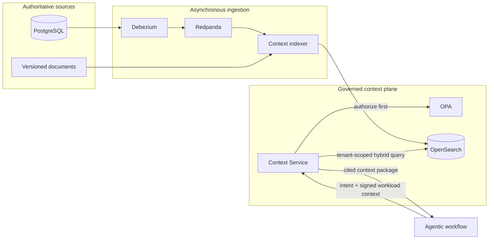

# Agentic Context Service

> Sources publish once. Agentic workflows retrieve one way.

Agentic Context Service is a governed context and memory hub backed by OpenSearch. Source
systems publish changes asynchronously; every agent retrieves fresh, cited context through one
stable API without learning about databases, CDC infrastructure, index names, embedding models,
or OpenSearch query syntax.

This is an enterprise context-engineering reference implementation—not a chat-with-documents
demo and not an agent framework.

## Why agents need a context service

An agent usually needs exact identifiers, semantically related records, current policy, user
entitlements, citations, and memory. Rebuilding that plumbing in every workflow creates inconsistent
security and stale, unauditable answers.

This project centralizes the difficult parts:

- PostgreSQL changes reach the retrieval hub asynchronously through Debezium and Redpanda.
- OpenSearch combines exact BM25 matching with semantic vector retrieval.
- OPA constrains the candidate set **before** ranking.
- Every result carries its source record, version, trust class, and freshness.
- Agent memory is useful but remains visibly separate from institutional truth.
- Replays, duplicates, out-of-order events, deletion, and dependency failures have deterministic
  behavior.

## Architecture



The workflow has one retrieval dependency: the Context Service. OpenSearch remains a derived hub;
source systems remain authoritative.

The core uses small Python `Protocol` ports. FastAPI, OpenSearch, OPA, Kafka, embeddings, clocks,
IDs, telemetry, and audit sinks are adapters assembled in explicit composition roots.

## Ten-minute local showcase

Prerequisites: Docker with Compose v2, Python 3.13, `uv`, and `make`.

```bash
git clone git@github.com:hseshadr/agentic-context-service.git
cd agentic-context-service
cp .env.example .env
make bootstrap
make up
make seed
make demo
```

The deterministic `demo-retail`/`NORTHSTAR` story shows:

1. hybrid-ranked pricing context with citations;
2. a PostgreSQL update flowing through real CDC;
3. the new source version and freshness becoming searchable;
4. a denied or filtered unauthorized persona;
5. session memory retrieved later as non-authoritative context;
6. trace, metrics, audit, and evaluation evidence.

`make demo` exits nonzero if an expectation is not met. Stop the stack without deleting named
volumes with:

```bash
make down
```

## API shape

Workflows call a bounded contract; they cannot submit raw OpenSearch DSL or choose a tenant.

```http
POST /v1/context:retrieve
Authorization: Bearer <delegated identity>
X-Workflow-ID: pricing-assistant
X-Workflow-Revision: 4f2d9e1
X-Environment: development
X-Request-ID: req_demo_001
X-Trace-ID: trace_demo_001
Content-Type: application/json

{
  "query": "Why did item NS-100 miss its pricing target?",
  "corpora": ["pricing", "product", "approved-decisions"],
  "filters": {"brand": ["NORTHSTAR"], "market": ["US"]},
  "retrieval": {
    "mode": "hybrid",
    "candidate_limit": 100,
    "result_limit": 12,
    "rerank": false,
    "max_context_tokens": 6000,
    "max_age_seconds": 300
  },
  "purpose": "pricing-analysis",
  "session_id": "sess_demo"
}
```

The response includes bounded untrusted context, component ranks, stable citations, source and index
timestamps, age, trust class, policy decision ID, ranking version, and partial/degradation status.
See the checked-in [OpenAPI contract](packages/contracts/openapi.yaml).

## Security model

Authorization precedes relevance. Tenant and entitlement scope come only from a verified identity
and signed workload context; user filters may narrow that scope but cannot widen it. OPA failure is
fail-closed. Every OpenSearch access is tenant constrained, agent-facing code receives no OpenSearch
credentials, and retrieved text is labeled untrusted data rather than executable instruction.

CDC writes use deterministic IDs, OpenSearch external versioning, managed aliases, and persistent
tombstones. A delayed event cannot resurrect a deleted record. Equal-version equivocation is an
explicit conflict rather than last-write-wins ambiguity.

Read the [threat model](docs/threat-model/README.md) and [security policy](SECURITY.md).

## Quality and evidence

```bash
make format
make lint
make unit
make integration
make bdd
make security
make eval
make verify
```

`make verify` is the canonical local/CI contract. Non-generated Python requires at least 90% line
and branch coverage. Real OpenSearch and CDC behavior is proved separately from the in-memory fast
test suite. Evaluation writes reproducible JSON and Markdown evidence under `reports/` and fails on
unauthorized results, missing citations, or a configured relevance regression.

## Guarantees and limits

The v1 contract guarantees tenant-scoped retrieval, mandatory provenance, deterministic replay and
deletion behavior, explicit freshness, and a portable workflow/source/backend boundary. It does not
turn OpenSearch into a transactional system of record, promise synchronous CDC visibility, execute
business transactions, promote memory autonomously, or require Kubernetes.

The local Compose stack disables some production controls to remain runnable on a laptop. Production
deployments require TLS, private networking, workload identity, OpenSearch document/field security,
durable audit storage, backups, retention policies, and domain-specific capacity/SLO validation.

## Project status

Pre-alpha and private while the AC-01 through AC-20 evidence ledger is completed. No package has
been published. See the [executable specification](docs/specification.md),
[roadmap](ROADMAP.md), [ADRs](docs/adr/), and [contribution guide](CONTRIBUTING.md).

Apache-2.0 licensed.
