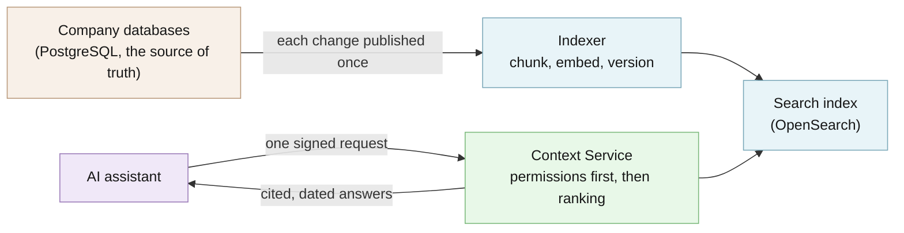

# Architecture

How Agentic Context Service is built, what it promises, and how those promises are checked.
Start with the [README](../README.md) if you have not run the quickstart yet. For a shorter tour
with the design rules, see the [five-minute architecture](architecture/README.md) and the
[interactive architecture map](architecture/index.html).

## The data path

Source systems publish each change once. PostgreSQL changes flow asynchronously through Debezium
(change data capture: it reads the database's change log) and Redpanda (a Kafka-compatible queue)
to an indexer. The indexer splits each record into chunks, computes embeddings (vectors that
capture meaning), and writes them to OpenSearch using the source version as the OpenSearch
version, so an older or replayed change can never overwrite a newer one.

An assistant sends one request to the Context Service API with a signed identity for the company
(tenant) and the job it is doing (purpose). Open Policy Agent (OPA) turns that identity into
constraints that filter the candidate set **before** any ranking. OpenSearch then combines exact
keyword matching (BM25) with vector search, and the two rankings are merged with reciprocal rank
fusion. The API returns compact, cited, freshness-labeled context that the assistant must treat as
untrusted data, not as instructions.



The Archify dataflow diagram [`governed-context-flow.html`](architecture/governed-context-flow.html)
is generated from
[`governed-context-flow.dataflow.json`](architecture/governed-context-flow.dataflow.json).

## Code structure

The core uses small Python `Protocol` ports (in `src/agentic_context_service/ports/`). FastAPI,
OpenSearch, OPA, Kafka, embeddings, clocks, IDs, telemetry, and audit sinks are adapters assembled
in explicit composition roots (`bootstrap.py`, `indexer.py`). The domain and application layers
import no vendor library. See [ADR 0001](adr/0001-hexagonal-context-plane.md).

## What the service can do

- Retrieve tenant-scoped, policy-filtered, hybrid-ranked context with mandatory citations and
  freshness through one bounded API. See the [OpenAPI contract](../packages/contracts/openapi.yaml).
- Project PostgreSQL changes into the index asynchronously, with deterministic replay, ordering,
  and deletion behavior. See [ADR 0004](adr/0004-versioned-indices-and-atomic-aliases.md) and
  [ADR 0005](adr/0005-bounded-retries-and-checkpoints.md).
- Store assistant memory that stays visibly labeled as non-authoritative. See the
  [specification](specification.md).
- Run a bounded agent proposal lane where deterministic code, not the model, approves. See the
  [retail pricing agent](../examples/retail-pricing-agent/README.md) and the
  [fulfillment agent](../examples/fulfillment-agent/README.md).
- Produce reproducible retrieval-quality evidence from a checked-in corpus with `make eval`.

## API shape

Workflows call a bounded contract. They cannot submit raw OpenSearch DSL or choose a tenant.

```http
POST /v1/context:retrieve
Authorization: Bearer <delegated identity>
X-Workflow-ID: pricing-assistant
X-Workflow-Revision: 4f2d9e1
X-Environment: development
X-Request-ID: req_demo_001
X-Trace-ID: trace_demo_001
Content-Type: application/json

{
  "query": "Why did item NS-100 miss its pricing target?",
  "corpora": ["pricing", "product", "approved-decisions"],
  "filters": {"brand": ["NORTHSTAR"], "market": ["US"]},
  "retrieval": {
    "mode": "hybrid",
    "candidate_limit": 100,
    "result_limit": 12,
    "rerank": false,
    "max_context_tokens": 6000,
    "max_age_seconds": 300
  },
  "purpose": "pricing-analysis",
  "session_id": "sess_demo"
}
```

The response includes bounded untrusted context, component ranks, stable citations, source and
index timestamps, age, trust class, policy decision ID, ranking version, and partial/degradation
status. Other routes: `POST /v1/context:batchRetrieve`, `POST /v1/memories`,
`POST /v1/memories:search`, `POST /v1/feedback`, `GET /v1/sources/{source}/freshness`,
`GET /health/live`, `GET /health/ready`, and `GET /metrics`.

## Security and trust model

- **Verified:** tenant and entitlement scope come only from a verified identity and a signed
  workload context (HMAC over the request headers with `ACS_SIGNING_SECRET`). User filters may
  narrow that scope but can never widen it. CDC writes use deterministic IDs and OpenSearch
  external versioning.
- **Refuses rather than warns:** if OPA is unavailable or undecided, the retrieval endpoints refuse
  the request and readiness fails. A delayed event cannot bring back a deleted record, and an
  equal-version conflict is reported rather than resolved by last-write-wins. In the agent
  examples, a missing tool call, stale or conflicting evidence, or a provider failure refuses to
  reserve.
- **Not protected:** a compromised host or operator, and anything the model provider you opt into
  does with the data sent to it. The local Compose stack disables some production controls (TLS,
  private networking, OpenSearch document/field security) to stay runnable on a laptop.
- **Verify a release:** no release has been tagged yet. To check a commit, run the same check CI
  runs (`make verify`).

Read the [threat model](threat-model/README.md). See [SECURITY.md](../SECURITY.md) for reporting a
vulnerability.

## What the tests prove, and what they do not

- Permission filtering, citation, freshness, replay, ordering, and deletion rules: the unit,
  contract, and security suites under [`tests/`](../tests/), run by `make verify` with at least 90%
  line and branch coverage.
- Real OpenSearch and CDC behavior: `make integration` with `ACS_TEST_OPENSEARCH_URL` pointing at
  the local Compose stack (without it, the real-OpenSearch test is skipped).
- Retrieval quality: `make eval` writes JSON and Markdown evidence under [`reports/`](../reports/)
  and fails on unauthorized results, missing citations, or a relevance regression.
- The browser showcase: a Chromium Playwright test (`make ui`) against the real FastAPI app.

They do **not** prove live CDC from the offline evaluator (that corpus records deterministic
results and never contacts OpenSearch), production capacity or SLOs, or the behavior of any real
model provider. The README quickstart uses the in-memory store, whose semantic search is a
deterministic stand-in, so it runs in exact-match (lexical) mode.

## The local showcase

```bash
cp .env.example .env
make bootstrap
make up
make seed
make demo
```

The deterministic `demo-retail` story (the demo brand is called `NORTHSTAR`) shows:

1. hybrid-ranked pricing context with citations;
2. a PostgreSQL update flowing through real CDC;
3. the new source version and freshness becoming searchable;
4. a denied or filtered unauthorized persona;
5. session memory retrieved later as non-authoritative context;
6. trace, metrics, audit, and evaluation evidence.

`make demo` exits nonzero if an expectation is not met. Stop the stack without deleting named
volumes with `make down`. See [operations](operations.md) for health checks and playbooks.

The dashboard at `http://localhost:8080/showcase/` is an observation surface; see the
[showcase boundary](architecture/README.md#showcase-boundary).

### Browser test

```bash
make ui-install
make ui
```

This browser test is separate from `make verify`, so a normal library or CDC check does not
download a browser. CI runs it for every pull request and push to `main`. To run the same flow
against the running Compose stack, including the idempotent fulfillment-promise mutation, its CDC
projection, a bounded proposal, explicit human approval, and a deterministic transaction trace:

```bash
PLAYWRIGHT_BASE_URL=http://127.0.0.1:8080 PLAYWRIGHT_LIVE_CDC=1 make ui
```

The local demo transaction adapter is a no-op; it never creates a real order.

## Configuration

All settings are `ACS_`-prefixed environment variables, loaded from an ignored `.env`
(template: [`.env.example`](../.env.example)). Secrets go only in `.env`, never in the repository.

| Variable | Default | What it changes |
| --- | --- | --- |
| `ACS_SIGNING_SECRET` | required (at least 32 characters) | Key for signed workload-context headers |
| `ACS_OPENSEARCH_URL` | `http://localhost:9200` | Search index endpoint |
| `ACS_OPA_URL` | `http://localhost:8181` | Policy decision endpoint |
| `ACS_KAFKA_BOOTSTRAP_SERVERS` | `localhost:19092` | CDC event stream |
| `ACS_EMBEDDING_MODEL` | `all-MiniLM-L6-v2` | Embedding model for semantic search |
| `ACS_SHOWCASE_AGENT_MODE` | `deterministic` | `deep` enables the optional live model proposal |
| `ACS_AGENT_MODEL` | unset | `openrouter:` model identifier for `deep` mode |
| `OPENROUTER_API_KEY` | unset | Your provider key for `deep` mode |

The full list lives in
[`settings.py`](../src/agentic_context_service/config/settings.py).

## What leaves your machines

Nothing by default. The quickstart makes no network calls (the test suite blocks network access).
Only if you switch the optional live AI mode on (`ACS_SHOWCASE_AGENT_MODE=deep`) do the demo task
and the cited facts its two read-only lookup tools return go to the OpenRouter model you
configure, with your own key.

## Shipped and planned

**Shipped** (on `main`; no tagged release yet): hybrid retrieval with permissions, citations, and
freshness; the PostgreSQL → Debezium → Redpanda → OpenSearch projection; non-authoritative memory;
the local Compose showcase; offline evaluation evidence; and the bounded agent examples.

**Planned (not shipped):** high availability, backup/restore and disaster recovery, a reranker
(only if evaluation shows material gains), memory correction and erasure, SDKs, load tests, signed
policy bundles, and a production Helm example. See [ROADMAP.md](../ROADMAP.md).

It does not turn OpenSearch into a transactional system of record, promise synchronous CDC
visibility, execute business transactions, promote memory autonomously, or require Kubernetes.
