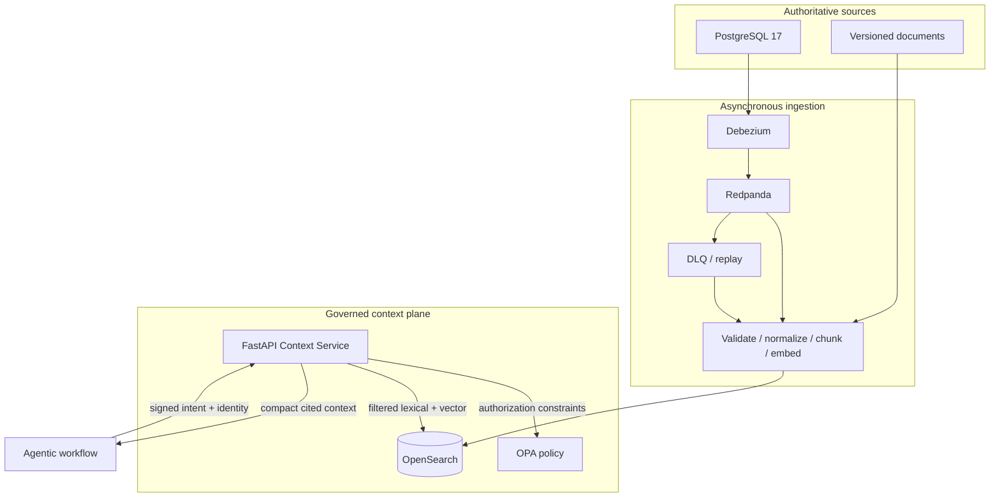

# Five-minute architecture

Agentic Context Service is a governed context plane. Sources publish changes once; workflows use
one API. OpenSearch is a replaceable derived store, never source truth.

## Invariants

- OPA constrains the candidate set before any ranking.
- User filters intersect policy; they never widen it.
- Stable source identity, version, timestamps, governance, and lineage accompany every result.
- Replays are idempotent and older source versions cannot win.
- Memory has separate indices/namespaces and cannot masquerade as institutional truth.
- Workflows know neither source connectors nor search DSL, aliases, mappings, or embedding models.

## Ports and adapters

The application owns small Protocols for search, embeddings, policy, reranking, events, clocks,
IDs, and audit. OpenSearch, OPA, Redpanda, deterministic embeddings, sentence-transformers, and
telemetry are adapters composed at process entrypoints. FastAPI is transport only.

## Evidence path

A signed request receives an OPA decision, constrained lexical/vector candidates, deterministic
fusion, token/freshness budgeting, citations, a safe audit record, a connected trace, and
Prometheus measurements. `reports/evaluation.*` records offline fixture evidence; container-backed
tests and `make demo` are required for live CDC claims.
