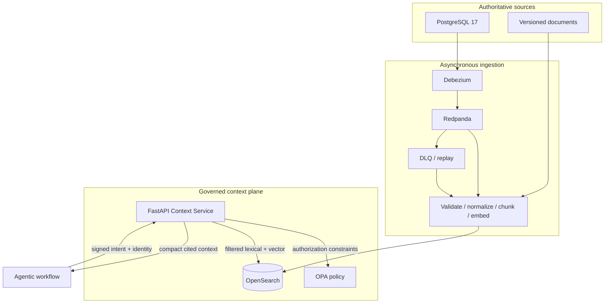

# Five-minute architecture

Agentic Context Service is a governed context plane. Sources publish changes once; workflows use
one API. OpenSearch is a replaceable derived store, never source truth.

For an explorable visual map, open [the governed context flow](governed-context-flow.html). Its
source is checked in as [typed Archify dataflow JSON](governed-context-flow.dataflow.json), so the
diagram can be reviewed alongside the code rather than maintained as a screenshot.

## Invariants

- OPA constrains the candidate set before any ranking.
- User filters intersect policy; they never widen it.
- Stable source identity, version, timestamps, governance, and lineage accompany every result.
- Replays are idempotent and older source versions cannot win.
- Memory has separate indices/namespaces and cannot masquerade as institutional truth.
- Workflows know neither source connectors nor search DSL, aliases, mappings, or embedding models.

## Ports and adapters

The application owns small Protocols for search, embeddings, policy, reranking, events, clocks,
IDs, and audit. OpenSearch, OPA, Redpanda, deterministic embeddings, sentence-transformers, and
telemetry are adapters composed at process entrypoints. FastAPI is transport only.

## Evidence path

A signed request receives an OPA decision, constrained lexical/vector candidates, deterministic
fusion, token/freshness budgeting, citations, a safe audit record, a connected trace, and
Prometheus measurements. `reports/evaluation.*` records offline fixture evidence; container-backed
tests and `make demo` are required for live CDC claims.

## Showcase boundary

The dashboard at `/showcase/` is an observation surface: it serves redacted snapshots and SSE
events and has no authority to execute arbitrary business work. Its sole local control starts one
fixed, idempotent fulfillment-promise source update. The indexer publishes the display-safe bundle
only after OpenSearch acknowledges the correlated projection, and the API then renders the ordered
`source_changed → cdc_received → projection_applied` trace. It then retrieves the matching typed
fulfillment fact through the same governed API, records a bounded `reserve`/`decline` proposal, and
shows deterministic reservation transitions. The local demo transaction adapter is deliberately a
no-op: it demonstrates authority and compensation sequencing without creating an order. The browser
proof uses the same route; the live Compose proof is documented in the README.

The optional [fulfillment agent example](../../examples/fulfillment-agent/README.md) makes the
boundary explicit. Pydantic Deep may make a proposal using two read-only tools; deterministic fact
validation and the transaction adapter retain all decision and side-effect authority. There is no
human-in-the-loop path in this showcase.
