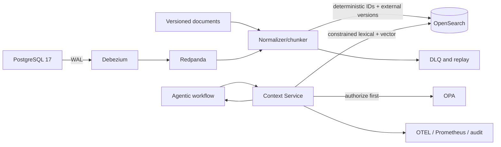

# Agentic Context Service executable specification

Status: v1 implementation contract
Working project name: **Agentic Context Service**
License: Apache-2.0

## 0. Execution contract

Inspect existing work first, preserve unrelated edits, implement vertical slices, and retain test
and report evidence. Warnings are failures unless an ADR explicitly and narrowly accepts one.
Never claim an acceptance criterion without executing its verification or a stronger equivalent.
Keep secrets out of source control. Do not publish, push, create cloud resources, or deploy
externally without separate authorization.

Fixed v1 stack: Python 3.13, `uv`, FastAPI, Pydantic v2, Uvicorn, `httpx`, official async
OpenSearch client, PostgreSQL 17, Debezium PostgreSQL connector, Redpanda's Kafka protocol, OPA
and checked-in Rego, deterministic fake embeddings in tests, `all-MiniLM-L6-v2` in the demo, a
no-op reranker, OpenTelemetry OTLP, Prometheus, pytest/pytest-asyncio/pytest-bdd, Testcontainers
where useful, Ruff, strict mypy, Bandit, pip-audit, Poe tasks behind thin Make targets, OpenAPI
3.1, JSON Schema 2020-12, Docker Compose v2, and Apache-2.0.

The implementation uses hexagonal boundaries (`domain`, `application`, `ports`, `adapters`,
`api`, and `config/wiring`). Vendor SDK types never cross inward boundaries. Swappable behavior is
expressed through narrow typed Protocols and constructor injection. Domain behavior uses plain
classes and frozen/slotted dataclasses; Pydantic stays at transport, event, configuration, and
persistence boundaries. FastAPI routes translate and delegate only. No service locator, ambient
registry, stateful mixin, hidden singleton, or import-time composition is permitted.

Externally visible writes are idempotent, retry-safe, and ordered with deterministic keys,
external versions, bounded retries, and checkpoints advanced only after durable side effects.
Time, IDs, I/O, embeddings, policy, persistence, and networking are injected. Tests are
deterministic and never use sleeps except bounded eventual-consistency polling in integration
tests. New non-generated Python maintains at least 90% line and branch coverage.

Required commands are `make bootstrap`, `format`, `lint`, `unit`, `integration`, `bdd`,
`security`, `eval`, `up`, `seed`, `demo`, `down`, `clean`, and `verify`. Poe owns their canonical
definitions. Demo and test failures must produce a nonzero exit status.

## 1. Executive decision

Build one enterprise Context Service backed by OpenSearch. Enterprise systems asynchronously
publish changes through governed CDC/indexing pipelines. Workflows retrieve institutional context
and optionally persist governed memory through the Context Service; they never integrate directly
with source databases, SaaS systems, documents, CDC, embeddings, or OpenSearch internals.

OpenSearch is a derived retrieval hub, not the system of record. Every indexed record carries
provenance, authorization metadata, freshness, and stable source identity.

> **Golden rule: sources publish once; workflows retrieve one way.**

The OSS showcase is the full enterprise problem: continuous source changes become governed,
cited agent context with measurable outcomes—not a file-upload vector-search tutorial.

## 2. Goals and non-goals

Goals are one stable context API, hybrid lexical/semantic/metadata/temporal retrieval, exact
identifier preservation, asynchronous population, policy for identity/workflow/purpose/environment,
compact ranked citations, separated memory trust, auditability, independent workload scaling, and
freedom from search topology or model lock-in.

OpenSearch is not a transactional system of record. The service does not execute business
transactions, replace a data lake, promise synchronous source visibility, require a graph database,
or promote agent-generated content into institutional truth.

## 3. Architectural principles

1. Workflows use one versioned retrieval contract.
2. OpenSearch indices, aliases, mappings, and DSL remain internal.
3. CDC is asynchronous; freshness is explicit and measurable.
4. Authorization constrains candidates before relevance ranking.
5. Hybrid retrieval is the default.
6. Provenance is mandatory.
7. Institutional truth outranks memory.
8. Policy, budgets, telemetry, and releases bind to workflow ID and immutable revision.
9. At-least-once ingestion is idempotent and monotonically ordered.
10. Owned contracts prevent source, framework, and retrieval-vendor lock-in.

## 4. Logical architecture

Runtime dependency rule: `Workflow -> AI Gateway -> Context Service -> OpenSearch`. A live
transactional lookup is a separately governed business tool, never a hidden retrieval bypass.

## 5. Component responsibilities

Connectors capture snapshots and changes but contain no workflow ranking. Redpanda buffers and
replays but is not authoritative. The indexer validates, normalizes, classifies, chunks, embeds,
and bulk-indexes but does not serve queries. OpenSearch stores derived documents and executes
filtered retrieval but does not make business authorization decisions. Context Service validates,
authorizes, retrieves, ranks, budgets, cites, and audits but does not expose DSL. OPA decides
constraints but does not rank. Workflows state intent and consume cited results.

## 6. Data planes and index families

Physical indices are versioned and hidden from workflows. Logical families are institutional
(`context-institutional-read`), memory (`context-memory-read`), operational evidence
(`context-evidence-read`), and control/checkpoints/tombstones (`context-control-read`). Each has
independent lifecycle and trust policy.

The canonical document is defined by
[`canonical-document.schema.json`](../packages/contracts/jsonschema/canonical-document.schema.json).
Its stable `_id` is the SHA-256 of tenant, source system, resource, record ID, and chunk ordinal.
Monotonic `source_version` rejects older events. Deletes remove or tombstone every derived chunk.

## 7. Asynchronous ingestion and CDC

The versioned [CDC envelope](../packages/contracts/jsonschema/cdc-envelope.schema.json) carries
event ID, source, partition key, UPSERT/DELETE, source version, occurrence time, schema version,
payload or immutable payload reference, and trace ID.

Processing validates the envelope, resolves a full record when needed, normalizes, classifies,
chunks using a versioned strategy, embeds only changed content hashes, bulk-upserts deterministic
IDs with external version ordering, and advances the checkpoint only after OpenSearch acknowledges
the batch. Delivery is at least once. Poison events go to a reasoned, traceable DLQ.

Every connector supports initial snapshot, count/hash reconciliation, targeted replay, shadow
index migration, and deletion/erasure verification. Freshness classes are F1 (p95 <= 60 seconds),
F2 (<= 5 minutes), F3 (<= 60 minutes), and F4 (daily). Results expose source update, index time,
and age. `max_age_seconds` causes omission or `CONTEXT_STALE`, never silent staleness.

## 8. Context Service API

The canonical [OpenAPI 3.1 contract](../packages/contracts/openapi.yaml) specifies:

- `POST /v1/context:retrieve` and `POST /v1/context:batchRetrieve`;
- `POST /v1/memories`, `POST /v1/memories:search`, `PATCH/DELETE /v1/memories/{id}`;
- `POST /v1/feedback`, `GET /v1/sources/{source}/freshness`;
- `GET /health/live` and `GET /health/ready`.

Governed requests carry delegated authorization plus signed team, app, workflow, revision, agent,
environment, cost-center, request, and trace headers. No endpoint accepts arbitrary OpenSearch DSL.

## 9. Retrieval pipeline

Validate identity and budget; ask OPA for corpora, classifications, fields, namespaces, actions,
and limits; intersect user filters so they can only narrow; run lexical and vector retrieval over
permitted aliases; fuse with reciprocal-rank fusion; optionally rerank; deduplicate/diversify;
apply trust/freshness/temporal rules; fit the token/latency budget; then return citations and emit
audit evidence. Access control never depends on an LLM.

The v1 score is reciprocal-rank fusion with `k=60`, multiplied by versioned trust, freshness, and
validity weights. Exact identifiers demonstrate lexical value; paraphrases demonstrate semantic
value. Reranking is a no-op until measured task improvement justifies another model.

## 10. Agent memory model

Memory shares retrieval infrastructure but never the institutional trust domain. Working memory is
session-scoped and short-lived; episodic memory captures prior governed outcomes; preference memory
requires user approval; semantic memory remains proposed pending approval; institutional content is
created only by source/governance processes. Namespace dimensions are tenant, user/workload,
workflow, revision, environment, and session. Inferred or agent-authored content is `proposed` or
`agent-derived`; it cannot overwrite, supersede, or outrank authoritative content.

## 11. Security and governance

The gateway validates identity and signed canonical headers. OPA evaluates user, team, workflow,
revision, environment, purpose, source, classification, region, and operation. Context Service
translates allow decisions into non-removable alias, document, field, and namespace constraints and
post-validates results. Any OPA absence, timeout, malformed response, or uncertainty fails closed.

Production requires TLS, encryption at rest, private networking, separate query/index/admin/audit
identities, no workflow OpenSearch credentials, PII/PCI/secret scanning, field allowlists,
redaction, entitlement-partitioned caches, environment isolation, complete erasure propagation,
prompt-injection scanning, trust labels, and tamper-evident audit. Retrieved content is data, never
an executable instruction. The local Compose stack's disabled OpenSearch security is explicitly
test-only.

## 12. Reliability, performance, and cost

Initial targets: 99.9% monthly retrieval availability; p95 hybrid retrieval <=300 ms excluding an
optional LLM reranker; p95 end-to-end <=700 ms; zero unauthorized results; 100% citations; and 100%
CDC replay correctness. Vector failure may degrade to marked lexical-only results only when policy
permits. Policy failure always closes. Stale results omit/fail. Reranker failure returns recorded
fusion. Cache use is short-lived and bound to the complete entitlement context.

Measure cost per successful workflow task: retrievals, reformulations, context tokens, model calls,
completion, and attributable infrastructure by workflow revision and cost center.

## 13. Observability and evidence

W3C trace context connects gateway, API, OPA, query/embedding pipeline, OpenSearch, reranker, and
workflow. Metrics include latency/timeout/partial, lexical-vector overlap, zero results, freshness,
CDC throughput/duplicates/stale rejects/DLQ, embedding cache, denials, source utilization, task
completion, and cost dimensions. Audit captures query hash—not prohibited raw secrets—policy
decision, returned source IDs/versions, ranking version, latency, and caller context.

Release evidence records API/schema, ranking, mapping/template, model, OPA bundle, source
checkpoint, golden corpus, entitlement, relevance, and load-test versions.

## 14. Testing and acceptance

The pyramid contains unit, public-contract, container integration, adversarial security, retrieval
evaluation, BDD, and resilience/load tests. Release gates are zero unauthorized results, complete
citations, monotonic ordering, replay-equivalent index state, timely deletion, baseline relevance
and task completion, and latency/freshness/cost SLOs.

## 15. Deployment topology

The contract remains portable across local Docker, self-managed OpenSearch, and managed providers.
The public implementation needs no cloud account. Kubernetes is not a v1 prerequisite. Retrieval,
memory, operational evidence, and control planes may share a local node but have independent
indices, retention, access, scaling, and production risk boundaries.

## 16. OSS product shape and ten-minute showcase

Public boundaries are versioned OpenAPI, CDC JSON Schema plus connector conformance, and internal
ports with OpenSearch as the first adapter. The synthetic `demo-retail` / `NORTHSTAR` scenario uses
no enterprise or customer data. A reviewer observes eight steps:

1. Start PostgreSQL, Redpanda, Debezium, OpenSearch, OPA, indexer, API, and telemetry.
2. Retrieve hybrid-ranked, cited retail-pricing context.
3. Update a PostgreSQL pricing record.
4. Observe the CDC event become searchable asynchronously.
5. Repeat retrieval and see a new source version and freshness.
6. Use an unauthorized persona and see denial or a constrained candidate set.
7. Store/retrieve memory while its non-authoritative label remains visible.
8. Inspect connected telemetry and the retrieval evaluation report.

The CLI is the v1 interface; no custom orchestration framework or complex web UI is needed.

## 17. Delivery plan

Phase 0 freezes contracts, skeleton, architecture decisions, retail scenario, and baseline corpus.
Phase 1 delivers Compose, PostgreSQL CDC, one deterministic document connector, retrieval,
citations, policy, audit, freshness, replay, demo, and evaluation; memory writes are deterministic,
not autonomously inferred. Phase 2 adds HA, autoscaling, backups, lifecycle, DR, reconciliation,
red teams, governed memory lifecycle, SDKs, and dashboards. Phase 3 adds connector conformance and
relationship expansion only for measured needs.

## 18. Implementation task DAG

| Task | Depends on | Deliverable | Acceptance |
|---|---|---|---|
| T-01 | — | Foundation, CI, governance | AC-01, AC-02 |
| T-02 | T-01 | Contracts, core, ports, errors | AC-03, AC-04 |
| T-03 | T-02 | Versioned OpenSearch schema/aliases | AC-05 |
| T-04 | T-02 | OPA and signed-context validation | AC-06, AC-07 |
| T-05 | T-02, T-03 | Normalize, chunk, embed, bulk index | AC-08, AC-09 |
| T-06 | T-05 | PostgreSQL CDC, DLQ, replay | AC-10, AC-11 |
| T-07 | T-03, T-04 | Hybrid retrieval, budgets, citations | AC-12–AC-14 |
| T-08 | T-03, T-04 | Governed memory | AC-15, AC-16 |
| T-09 | T-04, T-07 | Telemetry and audit | AC-17 |
| T-10 | T-07 | Golden evaluation | AC-18 |
| T-11 | T-06–T-09 | Compose, seed, CLI showcase | AC-19 |
| T-12 | all | Release evidence and security | AC-20 |

Critical path: T-01 -> T-02 -> T-03 -> T-05 -> T-06 -> T-11. T-04 precedes every usable endpoint.

## 19. Executable acceptance criteria

**AC-01 — Reproducible bootstrap.** `make bootstrap` runs twice successfully and the second run
causes no unintended tracked changes.

**AC-02 — Baseline quality.** Canonical Poe-backed formatting, lint, unit tests, strict typing,
complexity, architecture boundaries, and >=90% line/branch coverage pass. Required OSS governance,
architecture, environment example, and CI files exist.

**AC-03 — Contract completeness.** Checked-in OpenAPI validates and covers every Section 8 endpoint,
canonical headers, examples, stable errors, pagination where needed, and no raw search DSL.

**AC-04 — Dependency direction.** Automated architecture/adapter tests prove inward layers exclude
framework/vendor SDKs, routes delegate, adapters satisfy Protocols, and only composition roots wire.

**AC-05 — Repeatable index provisioning.** Empty OpenSearch bootstrap is idempotent and shadow
migration atomically changes the read alias without data loss.

**AC-06 — Fail-closed authorization.** Unavailable, malformed, or slow OPA returns the stable
authorization-dependency error and no content; readiness is false while liveness stays true.

**AC-07 — Candidate isolation.** Different personas produce different permitted candidates. User
filters cannot widen OPA, forged headers fail, and caches never leak across tenant/workflow context.

**AC-08 — Idempotent ordered indexing.** Three replays create one logical version, older versions
cannot overwrite new, and unchanged normalized content does not re-embed.

**AC-09 — Update/delete semantics.** Updates leave no orphan chunks. Deletes remove/tombstone every
chunk, embedding, and projection within the window while retaining permitted audit.

**AC-10 — Real asynchronous CDC.** A test updates PostgreSQL without calling API/indexer directly;
Debezium emits via Redpanda, indexer consumes, and API polling returns new version/freshness.

**AC-11 — DLQ/replay.** Invalid schema reaches DLQ with reason/trace; corrected replay processes one
logical version and advances checkpoint only after successful indexing.

**AC-12 — Hybrid value.** The corpus proves lexical wins for an exact identifier and semantic adds
a paraphrase absent from lexical top-K; fusion retains both with component ranks.

**AC-13 — Provenance/freshness.** Every result has stable URI, record ID/version, source/index time,
age, trust, and strategy; incomplete public results fail contract validation.

**AC-14 — Degradation/budgets.** Candidate/result/token limits hold. Vector failure falls back only
when allowed and marked partial. Staleness omits or returns `CONTEXT_STALE` as requested.

**AC-15 — Namespace isolation.** Tenant/user/workflow/environment/session dimensions isolate memory,
with one explicitly permitted cross-session preference lookup.

**AC-16 — Trust boundary.** Agent/inferred memory stays proposed/agent-derived and cannot overwrite,
supersede, or rank as institutional truth; correction, expiry, supersession, deletion are tested.

**AC-17 — End-to-end evidence.** A demo connects API/OPA/retrieval/OpenSearch trace spans; Prometheus
exposes request/latency/denial/freshness; safe audit includes caller, query hash, policy ID, source
IDs/versions, ranking version, and latency.

**AC-18 — Reproducible evaluation.** `make eval` creates JSON/Markdown reports with Recall@K,
nDCG@K, MRR, citation completeness, unauthorized count, freshness, p50/p95, and versions. It fails
on any unauthorized result, incomplete citations, or checked-in threshold regression.

**AC-19 — Ten-minute story.** Clean `make up && make seed && make demo` runs all eight steps without
manual configuration, prints human-readable citations/freshness/denial/memory trust, and only exits
zero when expectations pass.

**AC-20 — Final gate.** `make verify` passes twice; no unexpected generated files remain; README has
five-minute architecture, ten-minute start, sample, tradeoffs, measured summary, threat-model/ADR
links; CI builds an SBOM and runs secret, dependency, and static security scans.

## 20. Completion report

Completion reports outcome, vertical slice, every AC-01..AC-20 as PASS/FAIL/BLOCKED with exact
evidence, material files, commands and measurements, limitations/deferrals, and ADR rationale. No
criterion is silently omitted and a partial build is never called complete.

## 21. Portfolio success criteria

An evaluator can see that this solves context engineering, uses real asynchronous CDC, proves
distinct lexical/semantic value, authorizes before ranking, returns stable citations, keeps memory
below institutional truth, measures relevance/security/freshness/latency/cost, uses adapters to
prevent lock-in, tests failure/replay/delete/order, explains itself in five minutes, and runs in ten.

Avoid in v1: custom orchestration, complex UI, multiple vector databases, autonomous memory
promotion, unmeasured knowledge graphs, Kubernetes prerequisite, or many shallow connectors.

## 22. Decision and stop rules

Low-level choices may proceed when fixed defaults and public contracts remain intact. Record ADRs
for chunking, fusion constant, index versioning, retry/backoff, caching, telemetry exporter defaults,
and security behavior. Stop only for a direct repository contradiction, destructive overwrite,
unavailable required credential/asset without a local adapter, incompatible criteria, or public
name choice before publishing.

## 23. Decisions

OpenSearch is the hub; ingestion is asynchronous; sources remain authoritative; Context Service is
the workflow's one retrieval dependency; hybrid/provenance are defaults; memory is isolated; OPA
runs for every governed request and fails closed. V1 selects 384-dimensional
`all-MiniLM-L6-v2`, PostgreSQL/Debezium F1/F2 CDC, no-op reranking, and policy-defined memory TTL.

## 24. Reference rationale

- [OpenSearch introduction](https://docs.opensearch.org/latest/getting-started/intro/)
- [OpenSearch agentic memory](https://docs.opensearch.org/latest/ml-commons-plugin/agentic-memory/)
- [OpenSearch Docker guidance](https://docs.opensearch.org/latest/install-and-configure/install-opensearch/docker/)

## 25. One-sentence architecture

**Agentic Context Service turns asynchronously indexed, policy-filtered OpenSearch content into
compact, fresh, cited context for every agentic workflow—without exposing source systems or
retrieval plumbing to the workflow.**
